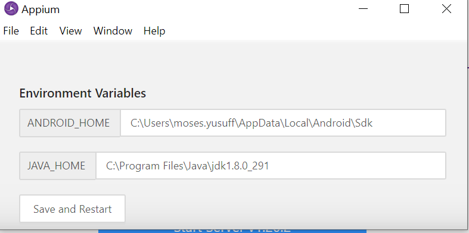
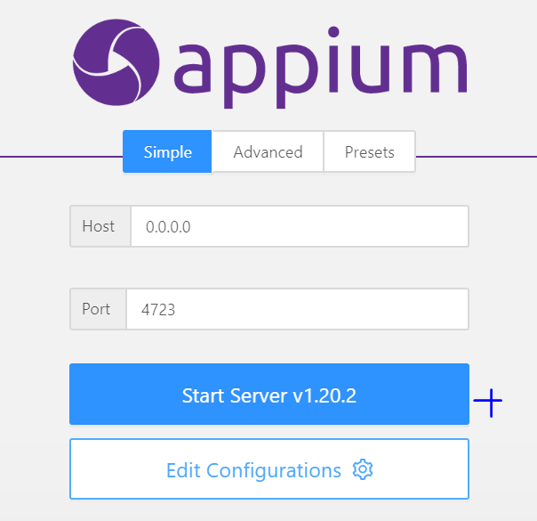
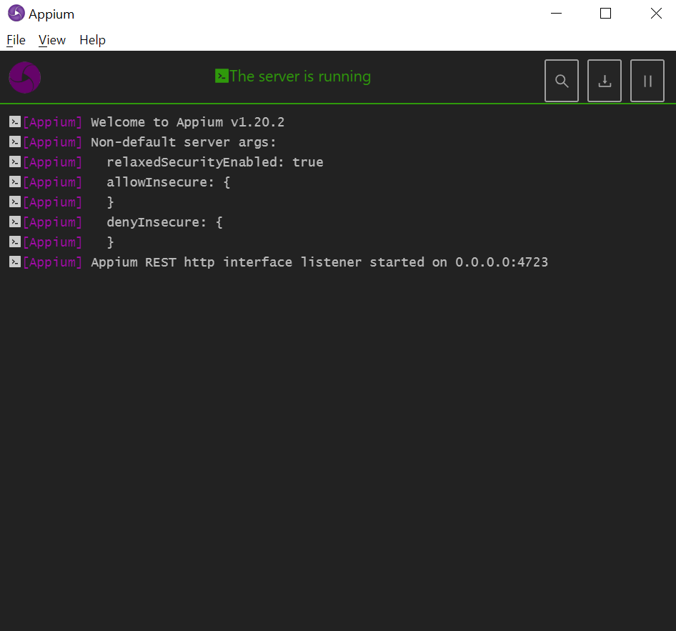

# Universal Music App Mobile UI Automation pack

# Purpose
This solution contains automation script written to perform end to end testing of the Universal Music App.
This app can be found in the resource folder within this project.

# Technology Used 
##Cucumber
To leverage existing written test cases and
and provide reporting of tests executed in natural human language.
##AppiumServer & Appium Client
For interacting and automating the Wb UI interface
##IntelliJ
Integrated Development Environment of choice
##Maven
The Build tool of choice which allows us to build the project by downloading and building relevant 
dependencies required to run the project.
##Node
Platform inwhich Appium server runs.

##AndroidStudio and AndroidEmulator
To emulate or simulate a phone inwhich the app will be installed and tested.
##GIT
Used for Version Control

##Test Approach.

The test approach used is PageObject pattern. The use of Page object patter allows 
flexibility in the maintenance and re-usability of test scripts. 

Under the test/Java folder we have two subfolder
test/Java/Screens- this includes all the pages which were interacted with.
In these pages,  it contains elements of each pages

test/Java/Steps folder, 
-we have the BaseClass, which contain the events 
which are re-usable through out the lifetime of the project

-we also have the StepDefiniton class which contains the definition of each step
consumed in the cucumber feature files

-the Steps class is a general class which contains the logic of the script.

test/Java/TestRunner 
This class is used to run the tests within the project. 

1. you may replace with any feature you wish to run,
2. you may include any tags within the specific feature you wish to run by typing "@logn". this tag will ensure to run all scenarios which has that tags.

In the resources folder, this folder includes feature files resources that are used.
This folder also included the application under test.

## Getting Started.
1. Install IntelliJ
2. Ensure you have Java installed on your PC   
3. Install Android Studio, from which you'll launch Android Emulator.
4. Install the application under test UAMPMusicPlayerApp.apk on the Emulator. 
   You can find it in the solution folder under resources
5. Install Node.js on your machine.
6. Install Appium Server, the latest stable version.
7. In appium under configurations, input the JAVA_HOME path and ANDROID_HOME path.
   
   
8. Start the Server

   
9. Make sure you have environments variable set for Java HOME, ANDROID_HOME, NODE_HOME, MAVEN_HOME
   Ensure you have git installed, it's usually installed with IntelliJ, but just double check to be sure
10. Open IntelliJ
   Click on file, New Project from Version control
   Version control - GIT
   Input the repo url - https://github.com/Dinho0/SauceLabsDemoAutomation.git
   Input directory of choice and clone
   Give it a bit of time to download /clone
11. Ensure to install Cucumber java plugins for IntelliJ
12. Ensure to install Gherkin plugins for IntelliJ
13. Run a Maven Install or Maven verify to download the dependencies.
14. Ensure all dependencies in the Pom.xml are all downloaded and resolved.
15. You may run the test, directly from feature files, or through the use of test runner class.

#Reports
after a successful run or fail of the test, in the terminal, a simple cucumber report generated and published in https://reports.cucumber.io/reports/0f1d2996-5373-422b-be02-12147a1b0d51
This sort of link can always been seen in the console after execution of each test.

